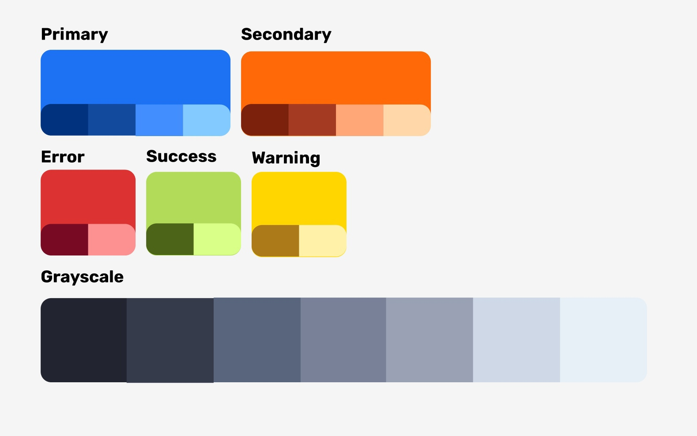
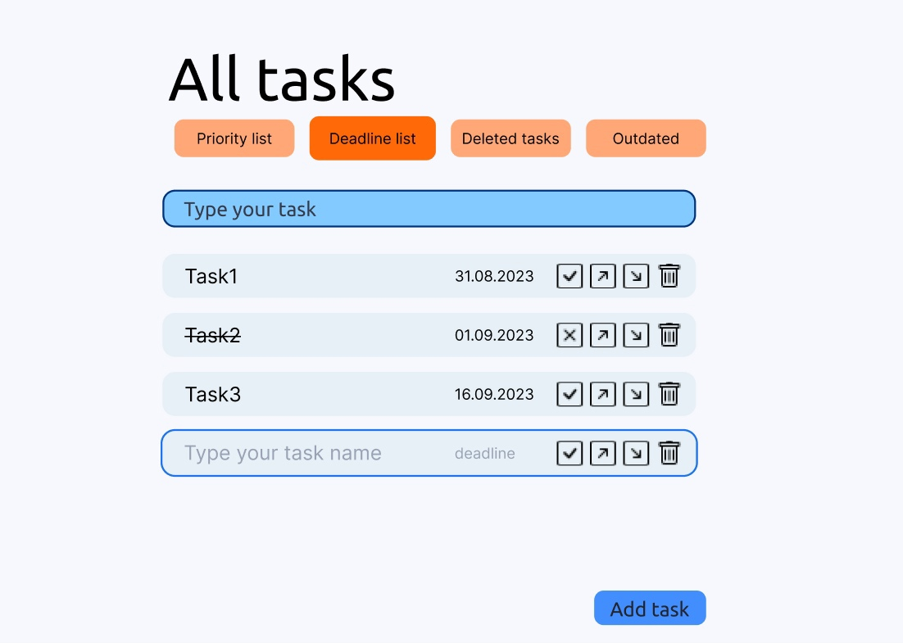

# Tasks organizer

Project to learn react and some other aspects of web applications. There will be a description of project when basic functionality added. 

## Launch

To run the project, clone the repository and run the following commands:

<ul>
<li><code>cd task-organizer</code></li>
<li><code>npm install</code></li>
<li><code>npm start</code></li>
</ul>

## Design development

Design was developed in figma.

<em><b>Picture 1.</b> Colors that are used in project</em>

<em><b>Picture 2.</b> Website model</em>